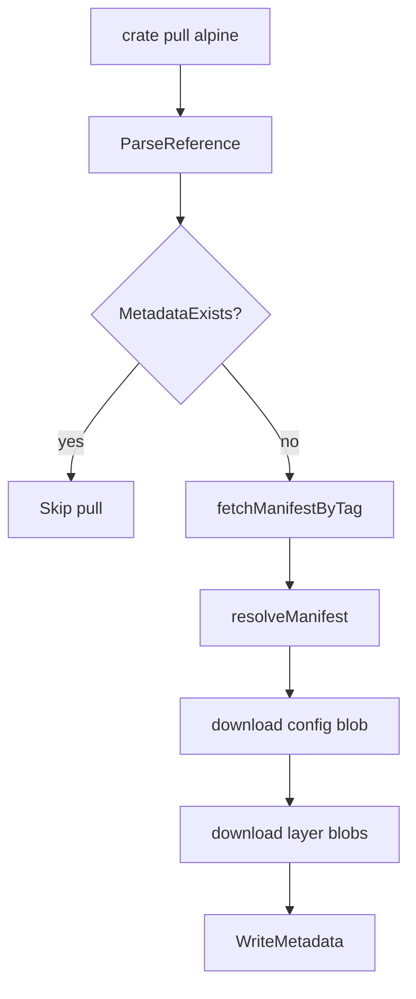

# Chapter 1 - Image Pulling

## What problem this solves

A container runtime needs filesystem content before it can start a process. That content comes from an image in a registry. Image pulling is the step that turns `alpine:latest` into local files on disk.

Without pulling, there is no config JSON, no layer tarballs, and nothing to unpack into a root filesystem.

At a systems level, pulling is about moving from a mutable name (tag) to immutable content (digests). That distinction is what makes containers reproducible.

## Basic concept

An image pull is usually:

1. Parse image reference (repo, tag, registry).
2. Authenticate to registry.
3. Resolve manifest.
4. Download config blob and layer blobs.
5. Save metadata so future runs can reuse local data.

Think of this as two planes:

- Control plane: tags, manifests, auth, metadata.
- Data plane: actual blob bytes for config and layers.

Most reliability bugs happen when those two planes diverge (for example, metadata says blobs exist but files are missing).

## How Docker and container runtimes normally solve it

Mainstream runtimes split responsibilities:

- Docker/CLI handles UX and naming rules.
- containerd/CRI plugins handle pull logic and content store.
- Registry protocol uses OCI/Docker v2 APIs.
- Content store is keyed by digest (`sha256:...`) for dedupe.

They also add retry logic, parallel downloads, signature checks, and advanced cache management.

From a theory point of view, production runtimes optimize three properties:

- Correctness: digest verification and media-type validation.
- Efficiency: dedupe by digest and parallel IO.
- Recoverability: crash-safe writes and resumable pulls.

## How this repo implements it

Crate keeps pulling intentionally small and readable.

The pull flow starts in `internal/image/pull.go`:

```go
if MetadataExists(imgRef) { return nil }
img, _ := resolveManifest(...)
downloadBlob(imgRef, img.Config)
for _, layer := range img.Layers { downloadBlob(imgRef, layer) }
WriteMetadata(imgRef, img)
```

A few important design choices:

- Pull is idempotent at metadata level: if metadata exists, it exits early.
- Blobs are downloaded by digest, so existing blob files can be reused.
- Metadata file is the local index that links tag/repo to config+layers.

The design choice here is pedagogical: crate uses a very explicit pull pipeline so you can see each stage and failure boundary.

Reference parsing in `internal/image/reference.go` normalizes short names:

- `alpine` becomes `docker.io/library/alpine:latest`
- default registry is `docker.io`
- default tag is `latest`

This normalization is more than convenience. It reduces ambiguity, and ambiguity is the enemy of reproducibility.

## Execution flow



## Try it mentally

Command:

```bash
crate pull alpine
```

Expected behavior:

1. First run downloads manifest + blobs and writes metadata.
2. Second run prints "Image already present" and returns quickly.

## Key takeaway

Image pulling is a pipeline from human-friendly image name to local digest-addressed files plus a metadata pointer.
