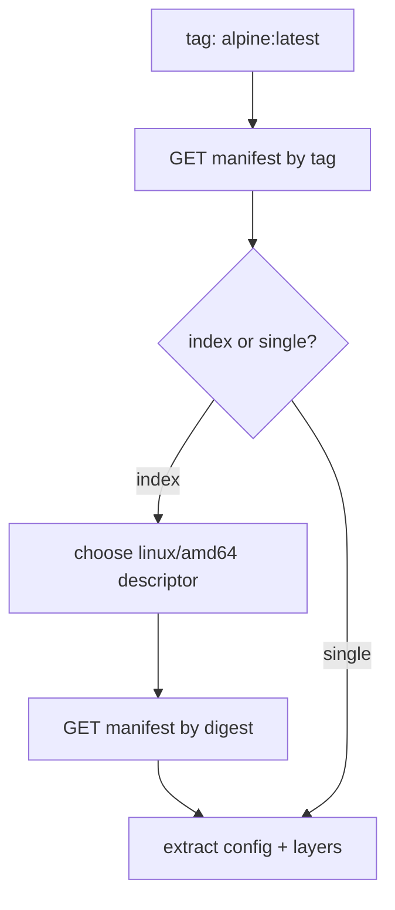

# Chapter 2 - Manifests

## What problem this solves

A tag like `ubuntu:latest` does not directly tell you which files to download. You need a manifest to discover:

- config digest
- layer digests
- platform-specific variant (amd64 vs arm64)

This is a pointer-indirection problem. A tag is not content; it is a name that resolves to content.

## Basic concept

Registry data model (simplified):

- Tag -> manifest list (optional, multi-platform index)
- Manifest list entry -> platform-specific manifest
- Manifest -> config digest + layer digests

So manifest resolution is the translator between a tag and concrete blob digests.

In distributed systems terms, tags are mutable references, while digests are immutable identities. Container runtimes depend on digest identity to avoid "works on my machine" drift.

## How Docker and container runtimes normally solve it

Production runtimes:

- Negotiate manifest media types through `Accept` headers.
- Select matching platform (`os/arch`, variant, features).
- Store descriptors in content-addressed metadata database.
- Verify digests and media types strictly.

They also keep descriptor graphs (manifest -> config/layers) in local metadata stores so they can answer "do I already have this content?" quickly without extra network calls.

## How this repo implements it

Crate supports OCI and Docker schema 2 media types, then recursively resolves to a single manifest.

From `internal/image/registry.go`:

```go
req.Header.Set("Accept", manifestAccept)
```

From `internal/image/manifest.go`:

```go
if isIndex(contentType) { return resolveSelectedPlatform(ref, data) }
if isSingleManifest(contentType) { return parseSingleManifest(data) }
return errorUnsupportedType
```

The selected platform is currently hardcoded to `linux/amd64`.

That is a deliberate simplification. Conceptually, platform resolution is policy. The parser reads possibilities; policy chooses one.

## Why this matters for learning

This file demonstrates an important systems idea:

A tag is not "the image". It is a pointer that may require one or more network fetches before you know the exact blobs.

This chapter teaches an important layering principle:

- Naming layer: tags and repo names.
- Descriptor layer: manifests and indexes.
- Content layer: blobs by digest.

Keep these separate in your head and the rest of runtime design gets easier.

## Resolution flow



## Code reading checklist

When you read this code, track these questions:

1. Which content type did the server return?
2. If it is an index, which platform is selected?
3. What exact config digest was returned?
4. In what order are layer digests listed?

Those four answers define what root filesystem you will eventually build.

## Key takeaway

Manifest resolution converts a friendly image tag into immutable digest references, which is the foundation of reproducible container execution.
