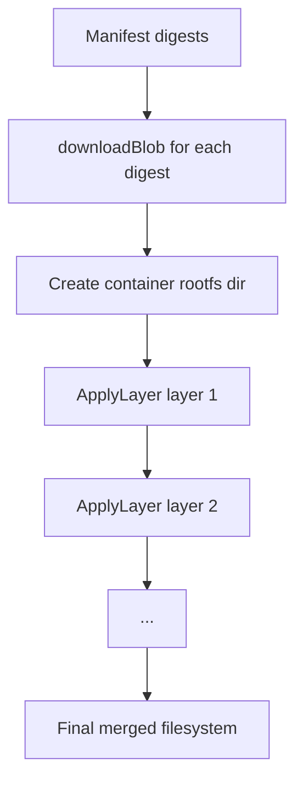

# Chapter 3 - Layers

## What problem this solves

Container images are built from stacked filesystem diffs. A runtime needs to:

1. Download each layer blob.
2. Apply them in order.
3. Handle deletes and replacements correctly.

If layer application is wrong, the container filesystem is wrong.

At a deeper level, layers are a compact history encoding. Runtime unpacking is effectively a replay engine for filesystem history.

## Basic concept

Each layer is usually a compressed tar archive representing changes from the previous layer.

- Add file
- Modify file
- Delete file (via whiteout markers)
- Add symlink/hardlink

Applying layers sequentially reconstructs the final rootfs.

You can model this as a fold operation:

$$
FS_{final} = (((FS_0 + L_1) + L_2) + ... + L_n)
$$

where each $L_i$ is a delta, not a full filesystem.

## How Docker and container runtimes normally solve it

Typical implementations use snapshotters (overlayfs, btrfs, zfs, stargz, etc.) so layers can remain separate and mounted efficiently.

Crate takes the educational route: unpack tar layers into a plain directory.

This is simpler to understand, slower in some cases, but excellent for learning.

Theory tradeoff:

- Snapshotters optimize space/time by reusing lower layers at mount time.
- Full unpacking optimizes understandability by producing one concrete directory tree.

## How this repo implements it

### Blob storage

`internal/image/store.go` stores blobs by digest path:

```go
algo, hash := splitDigest(digest)
path := root + "/blobs/" + algo + "/" + hash
```

This is content-addressing: digest determines path.

### Layer application

`internal/fs/layer.go` opens each layer as `gzip -> tar`, then replays entries into rootfs:

```go
for each tarEntry in layerTar:
  if whiteout(tarEntry): applyDeletion(tarEntry)
  else: materializeEntry(rootfs, tarEntry)
```

Whiteouts are key for correctness:

- `.wh.<name>` means remove `<name>` from lower layers.
- `.wh..wh..opq` means directory becomes opaque (clear inherited entries).

Whiteouts encode "negative updates". Without negative updates, layers could only add or overwrite, never delete.

## Layer pipeline in crate



## Why order matters

If layer N creates `/etc/foo` and layer N+1 deletes it via whiteout, final rootfs must not contain `/etc/foo`.

Crate preserves this by applying layers in manifest order.

This is causality in filesystem form: later layers are newer intent and must win.

## Key takeaway

A "container filesystem" is not magic. It is deterministic replay of tar diffs plus whiteout semantics.
