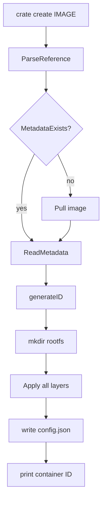

# Chapter 4 - Container Creation

## What problem this solves

After image data exists locally, you still need to construct a runnable container bundle:

- unique container ID
- rootfs directory populated from image layers
- config file capturing command/env/runtime mode

This chapter is where image data becomes a specific container instance.

Conceptually, creation is state materialization: convert reusable image artifacts into per-container state.

## Basic concept

Container creation is separate from container start.

- Create: materialize filesystem + metadata
- Start: spawn isolated process using that data

That split is how runtimes support workflows like "create now, start later".

The split also improves failure handling:

- Create can fail on filesystem or image issues before any process starts.
- Start can fail on namespace/mount/exec issues after state already exists.

## How Docker and container runtimes normally solve it

Docker and containerd keep rich state in metadata stores and often use snapshots instead of unpacking every time.

Crate keeps state as files under its data root and uses full layer application for each create.

In production systems this phase is often called "prepare rootfs" or "create task" and may involve snapshot mounts instead of unpacking.

## How this repo implements it

`internal/container/create.go` is the center of this logic.

```go
ref := ParseReference(imageName)
if missingLocalMetadata(ref) { Pull(imageName) }
meta := ReadMetadata(ref)
rootfs := allocateContainerRootfs(id)
applyAllLayers(meta.Layers, rootfs)
writeConfig(id, meta)
```

Important learning point:

- This repo now performs auto-pull during container creation if the image is missing locally.
- That means `crate create alpine` and `crate run alpine` can work without a prior explicit `crate pull`.

This choice localizes image-availability policy in one place. Centralizing policy usually makes runtime behavior easier to reason about.

### Config generation

`internal/container/config.go` builds a container config using image config blob data:

- `Cmd`
- `Entrypoint`
- `Env`
- rootless/rootful mode

This mirrors how OCI runtime bundles carry process defaults.

Theory lens: image config is an intent template; container config is a concrete instantiation of that intent plus runtime mode.

## Create and run relationship

`internal/runtime/run.go` is minimal by design:

```go
id, err := container.Create(image)
if err != nil { return err }
return Start(id, command)
```

So `run` is conceptually just `create + start`.

## Container creation flow



## Key takeaway

Container creation is the bridge between image abstractions and concrete runtime state on disk.
