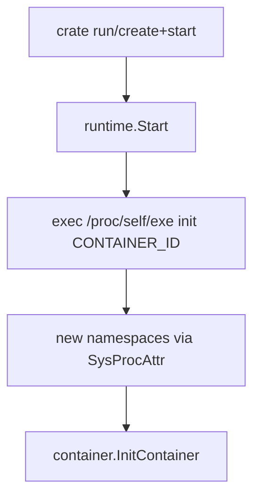

# Chapter 5 - Namespaces and Startup

## What problem this solves

A container is not only a filesystem. You must start a process with isolated kernel views (PID tree, hostname, mount namespace, and optionally user namespace).

This is the process-isolation boundary. Image data gives content; namespaces give isolation semantics.

## Basic concept

Linux namespaces give one process tree a private view of resources.

For this project:

- `CLONE_NEWPID`: container gets its own PID namespace.
- `CLONE_NEWUTS`: isolated hostname.
- `CLONE_NEWNS`: private mount namespace.
- `CLONE_NEWUSER` (rootless): UID/GID mapping for unprivileged execution.

Theory model:

- Filesystem isolation answers "what files can the process see?"
- Namespace isolation answers "what kernel view does the process perceive?"

Both are required for a useful container abstraction.

## How Docker and runtimes normally solve it

Most runtimes eventually call into low-level runtime tools (such as runc) that set up namespaces, cgroups, mounts, seccomp, capabilities, and more.

Crate focuses on namespace and mount fundamentals first.

Production runtimes add more isolation dimensions (network namespace, cgroups limits, seccomp policy). Crate's smaller scope is useful for understanding first principles.

## How this repo implements it

The startup path is in `internal/runtime/start.go`:

```go
cmd := exec.Command("/proc/self/exe", "init", containerID)
sys.Cloneflags = CLONE_NEWUTS | CLONE_NEWPID | CLONE_NEWNS
if rootless { sys.Cloneflags |= CLONE_NEWUSER }
cmd.SysProcAttr = sys
cmd.Run()
```

Notice the pattern: it re-execs the same binary with `init` subcommand. That child process becomes the container init logic.

From `cmd/crate/main.go`:

```go
if os.Args[1] == "init" {
    container.InitContainer(containerID, command)
    return
}
```

This self-reexec structure is a common runtime trick: parent orchestrates, child enters container setup path.

It separates concerns cleanly:

- Parent: policy and orchestration.
- Child: isolated environment setup and final exec.

## Startup control flow



## Key takeaway

The container boundary is created by kernel namespace flags at process creation time, not by image pulling or filesystem unpacking.
