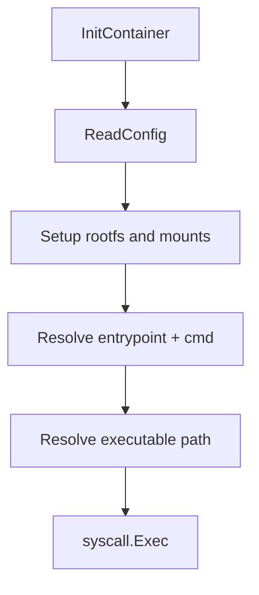

# Chapter 6 - Entrypoint and Exec

## What problem this solves

Once inside isolated namespaces and rootfs, the runtime still needs to decide exactly what process to run as PID 1.

This involves merging:

- image entrypoint
- image cmd
- user command override
- PATH lookup

This is the handoff point where runtime control ends and workload control begins.

## Basic concept

OCI-style command resolution usually follows a precedence model.

In practical terms:

- Entrypoint sets the executable prefix.
- Cmd supplies default args.
- User command can replace or append depending on whether entrypoint exists.

Think of this as command composition policy. The runtime must be deterministic here because PID 1 behavior defines container lifecycle behavior.

## How Docker and runtimes normally solve it

Production runtimes apply full OCI spec behavior, environment inheritance, working dir changes, user handling, and signal semantics.

Crate keeps this focused on entrypoint/cmd merging and direct `exec`.

The production version adds more policy knobs, but the core invariant is the same: compute one final argv and execute it without shell ambiguity.

## How this repo implements it

In `internal/container/exec.go`, command resolution is explicit:

```go
if hasEntrypoint && hasUserCmd { argv = entrypoint + userCmd }
else if hasEntrypoint { argv = entrypoint + cmd }
else if hasUserCmd { argv = userCmd }
else { argv = cmd }
```

Then path resolution checks PATH from image env or default fallback and finds executable.

Minimal path lookup idea:

```go
for _, dir := range strings.Split(pathEnv, ":") {
  if exists(dir + "/" + argv0) { return fullPath }
}
```

Finally, `internal/container/container.go` performs `syscall.Exec`, replacing PID 1 process image:

```go
execPath := resolvePath(argv[0], env)
syscall.Exec(execPath, argv, env)
```

No shell is inserted. The runtime executes the program directly.

That "no shell by default" rule avoids accidental interpretation differences and reduces injection surface.

## Filesystem setup before exec

Still in `InitContainer`, crate calls filesystem setup first:

- rootfs switch (`pivot_root` or `chroot`)
- mount `/proc`
- mount `/sys` (read-only rootful)
- mount `/dev` and `/run`

Only after that does it `exec` the target process.

Theory note: this ordering enforces a clean dependency chain:

1. isolation context first,
2. process selection second,
3. irreversible exec last.

## Process launch flow



## Key takeaway

Container startup ends when the runtime disappears and your target process becomes PID 1 inside the container namespace.
